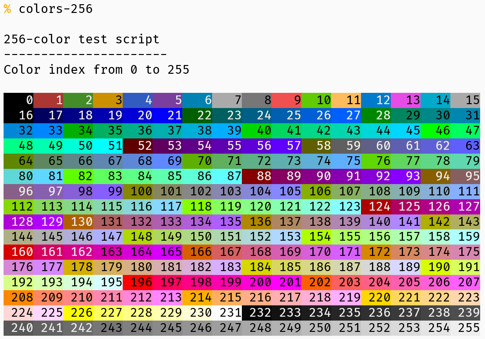

# colors-256

The script allows users to easily view the entire color palette by printing out a grid of all 256 colors with their corresponding color codes.

To use the script, simply clone the repository and run the script in your terminal. The script will then output a grid of all 256 colors, with their corresponding color codes, in your terminal window.

This script can be useful for anyone who needs to work with colors in a terminal environment or wants to explore the full range of ANSI colors available.

